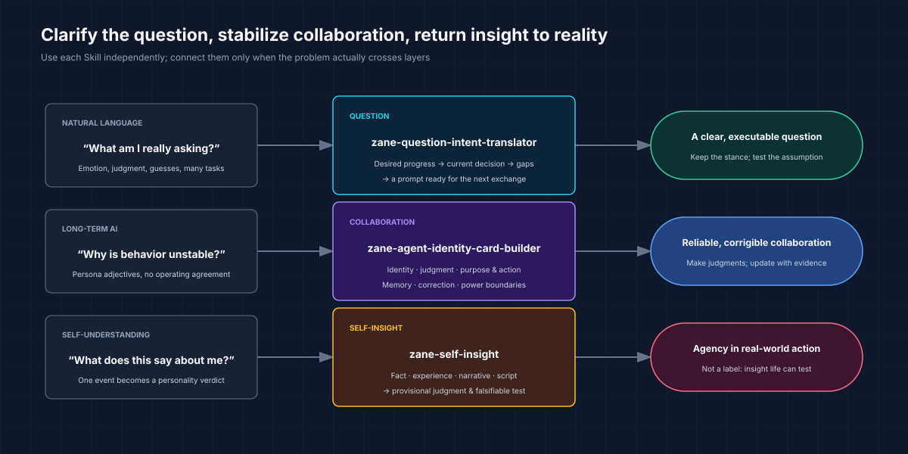

# Zane Dialogue Skills

[简体中文](README.md) | English

> Many AI failures are not model failures. The question was never made clear, the Agent was never operationally defined, or self-insight never returned to reality.

[](VERSION.md)
[](#three-skills)
[](LICENSE)

Three reusable dialogue Skills for ordinary users: translate messy natural-language questions into executable prompts, build an operational identity card for a long-term AI collaborator, and turn self-understanding into a testable real-world action.

**Each Skill works independently and can connect naturally when a problem crosses layers.**

[Quick start](#quick-start) · [What it solves](#what-it-solves) · [Three Skills](#three-skills) · [Install](#install) · [Method boundaries](#method-boundaries)



## What it solves

| What is happening | What these Skills help you produce |
| --- | --- |
| You have many thoughts but do not know what to ask AI | The real progress you want, the current decision, and a copyable prompt |
| One sentence mixes emotion, judgment, assumptions, and several questions | A clean separation of facts, hypotheses, ambiguity, and task without deleting your stance |
| AI keeps giving cautious answers that are technically correct but practically useless | A purpose-first answer tied to the current stage and next action |
| Your AI persona prompt is full of adjectives but behavior remains unstable | An operating contract for judgment, memory, correction, and boundaries |
| The AI either agrees with everything or behaves like a compliance auditor | Constructive disagreement without letting disclaimers erase action |
| You ask “Why am I like this?” but do not want a personality verdict | Facts, experience, self-narrative, external scripts, and testable patterns kept separate |
| Reflection keeps growing while life does not change | One observation, falsifiable experiment, or stopping point |

## Quick start

### 1. Install

```bash
npx -y skills add xuehuafu233-alt/zane-dialogue-skills -g --all
```

### 2. Start from the place where you are stuck

#### You do not yet know the real question

```text
Use zane-question-intent-translator.
I want to ask AI: “Am I simply not suited for entrepreneurship?”
Do not answer that conclusion yet. Identify the decision I am actually trying to make,
separate facts from my current interpretation and missing information,
then write a prompt I can use with the AI I am already talking to.
```

#### You want a long-term AI collaborator

```text
Use zane-agent-identity-card-builder.
I need a long-term partner for career and entrepreneurship work. It should make clear judgments,
distinguish the current stage from the final goal, and avoid blocking action with endless caveats.
It must also avoid flattery and dependency. Turn this into an operational identity card
and test it against three realistic scenarios.
```

#### You want insight, not another personality label

```text
Use zane-self-insight.
I keep wanting to rebuild the system just before I finish something.
Separate observed facts, my feelings, my explanation, and your testable hypotheses.
Give me a provisional judgment and one small experiment that could support or overturn it.
```

## Three Skills

### `zane-question-intent-translator`

This is not a prompt polisher. It is a problem-definition tool:

```text
Original words → desired progress → current decision
→ answer-changing ambiguity and assumptions → copyable prompt → next step
```

It preserves the user's tone, emotion, and stance, but treats the stance as a hypothesis rather than silently converting it into fact. The resulting question can be used immediately to continue the conversation or execute the task.

### `zane-agent-identity-card-builder`

It produces an operating agreement, not a role-play bio:

- who the Agent is, what it owns, and what it does not own;
- how it separates facts, user judgment, AI hypotheses, and unknowns;
- what decision the current stage needs and what action follows;
- what may be remembered and where authoritative sources live;
- how judgment changes after correction or new evidence;
- how to avoid flattery, absolute obedience, manufactured intimacy, and false authority.

The earlier `purpose-first-action-judgment` concept is now the purpose-and-action layer inside this Skill; it is not a separate installation.

### `zane-self-insight`

It supports self-understanding without producing personality verdicts. It keeps apart:

- observed facts;
- present experience;
- the user's interpretation;
- external scripts;
- AI hypotheses;
- new evidence that would change the conclusion.

It ends with a real-world observation, behavioral experiment, or more honest expression, rather than turning reflection into an endless loop.

## How they work together

Each Skill works independently. They can also connect when the problem naturally moves across layers:

```text
The question is unclear
→ zane-question-intent-translator
→ an executable question

Long-term AI behavior is unstable
→ zane-agent-identity-card-builder
→ a corrigible operating agreement

The question becomes “Why do I keep doing this?”
→ zane-self-insight
→ a provisional judgment and real-world test
```

You do not need to call all three. Start at the first layer that is actually unresolved.

## Install

```bash
npx -y skills add xuehuafu233-alt/zane-dialogue-skills -g --all
```

After installation, name the Skill directly in natural language. Exact invocation syntax depends on your Agent.

## Method boundaries

- Do not invent motives, facts, emotions, or life goals for the user.
- A better question is not automatically a correct answer.
- Do not turn every unknown into a prerequisite for action.
- Neutrality should not delete the user's real stance or manufacture artificial disagreement.
- An AI must not impersonate a human, create dependency, replace a professional, or seize real-world decision authority.
- Do not infer a stable personality from one emotion or event.

## Provenance and license

These methods grew from recurring failures in long-term AI collaboration: questions missing their real purpose, caution erasing action, persona prompts failing to produce stable behavior, and self-analysis drifting away from reality.

The public package contains no personal memories, chat logs, private paths, or copied third-party Skill files. See [Provenance](docs/provenance.md) for source boundaries. This repository is released under the [MIT License](LICENSE).

Author: Zane
