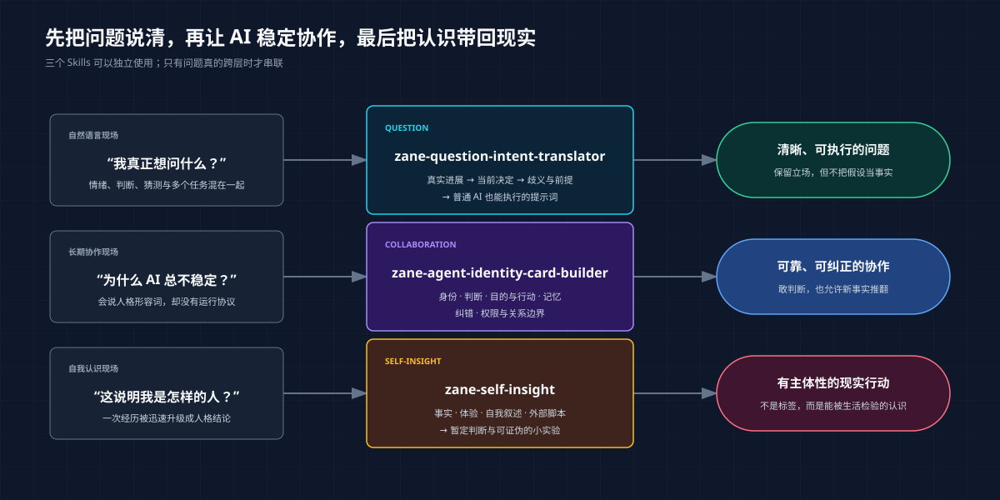

# Zane Dialogue Skills

简体中文 | [English](README.en.md)

> 很多 AI 问题，不是模型不会答，而是问题没有被说清、Agent 没有被定义、自我判断没有回到现实检验。

[](VERSION.md)
[](#三个-skills)
[](LICENSE)

这是一组面向普通人的对话方法 Skills：把含混的自然语言问题转成 AI 能执行的提问，为长期协作的 AI 建立可运行身份卡，并把对自己的理解变成可验证行动。

**不要求专家 Skill，不要求复杂工作台，也不依赖 Zane 的个人资料。**

[快速开始](#快速开始) · [它解决什么](#它解决什么) · [三个 Skills](#三个-skills) · [安装](#安装) · [方法边界](#方法边界)



## 它解决什么

| 你遇到的情况 | 这套 Skills 帮你得到 |
| --- | --- |
| 脑子里有很多想法，却不知道该怎么问 AI | 真正想推进的事情、当前决定和可直接复制的提示词 |
| 一句话混着情绪、判断、猜测和多个问题 | 保留真实立场，同时拆开事实、假设、歧义与任务 |
| AI 总是给正确但没用的保守答案 | 让它先识别当前目的、下一环和现在可做的动作 |
| 给 AI 写了很多人格形容词，实际表现仍不稳定 | 一份包含判断、记忆、纠错和边界的运行协议 |
| AI 不是讨好你，就是像审计员一样泼冷水 | 能表达异议，但不让免责说明冲掉行动 |
| 想知道“我为什么会这样”，又怕被一次经历定性 | 区分事实、体验、自我叙述、外部脚本和待验证模式 |
| 内省越来越多，现实却没有变化 | 一个可以观察、反证或停止继续分析的小动作 |

## 快速开始

### 1. 安装

```bash
npx -y skills add xuehuafu233-alt/zane-dialogue-skills -g --all
```

### 2. 选择你现在卡住的地方

#### 不知道自己真正想问什么

```text
请使用 zane-question-intent-translator。
我想问 AI：我是不是不适合创业？
先不要回答创业结论，先帮我找出这句话真正想推进的决定，
区分事实、我的当前判断和缺少的信息，再生成一条可以直接复制给普通 AI 的提示词。
```

#### 想建立一个长期协作的 AI

```text
请使用 zane-agent-identity-card-builder。
我需要一个长期协作的职业与创业伙伴。它要敢给判断，也要区分当前环节和最终目标；
不能用无限风险说明阻断行动，也不能为了亲近而讨好我。
请把这些要求写成可运行的身份卡，并用三个真实场景试跑。
```

#### 想看清自己，而不是再领一个人格标签

```text
请使用 zane-self-insight。
我发现自己总在快完成一件事时又想重做系统。
请区分已经发生的事实、我的感受、自我解释和你的待验证假设，
给一个暂定判断，以及一个能在现实中支持或推翻它的小实验。
```

## 三个 Skills

### `zane-question-intent-translator`

它不是“提示词润色器”，而是问题定义器：

```text
用户原话 → 真实想推进的进展 → 当前要做的决定
→ 会改变答案的歧义与前提 → 可复制提示词 → 下一步
```

它保留用户的情绪、立场和语气，但会把立场标成待检验假设，而不是偷偷当成事实。专家、搜索或其他 Skill 都只是可选下游。

### `zane-agent-identity-card-builder`

它创建的不是角色扮演简介，而是长期协作协议：

- Agent 是谁，负责什么，不负责什么；
- 如何区分事实、用户判断、AI 假设和未知；
- 当前环节要促成什么决定，下一步是什么；
- 哪些信息可以记忆，权威来源在哪里；
- 用户纠正或新证据出现时如何更新判断；
- 如何避免讨好、绝对服从、虚假亲密和权威幻觉。

原先单独设想的 `purpose-first-action-judgment` 已被吸收为身份卡中的“目的与行动”层，不需要额外安装。

### `zane-self-insight`

它帮助用户认识自己，但不替用户制造人格定论。它会优先拆开：

- 已发生事实；
- 当下体验；
- 本人解释；
- 外部脚本；
- AI 待验证假设；
- 会改变结论的新事实。

最后回到一次现实观察、行为实验或更诚实的表达，而不是把自我认识变成无限内省。

## 它们如何配合

三个 Skills 可以独立使用，也可以按问题自然串联：

```text
问题说不清
→ zane-question-intent-translator
→ 得到可执行问题

AI 长期表现不稳定
→ zane-agent-identity-card-builder
→ 得到可纠正的协作协议

问题最终指向“我为什么这样”
→ zane-self-insight
→ 得到暂定判断和现实验证
```

不是每次都要依次调用三个。哪个问题已经清楚，就从哪个环节开始。

## 安装

```bash
npx -y skills add xuehuafu233-alt/zane-dialogue-skills -g --all
```

安装完成后，可以直接在自然语言里点名 Skill。具体调用语法以你的 Agent 为准。

## 与相邻方法的区别

- **它不是提示词模板库**：重点是定义问题与当前决定，不是堆角色、格式和形容词。
- **它不强制专家讨论**：普通 AI 就可以使用转译后的提示词。
- **它不是专家聊天室主持器**：通用的诱导识别已进入问题转译；活动聊天室的共识审计应交给专门主持工具。
- **它不是心理治疗或人格测评**：只基于当前证据给暂定判断，并允许现实推翻。
- **它不是私人记忆系统**：是否长期记录、记录到哪里，仍由用户和使用环境决定。

## 方法边界

- 不替用户制造不存在的动机、事实、情绪或人生目标；
- 不把“好问题”冒充“正确答案”；
- 不把所有未知都升级成行动前置条件；
- 不用“中立”删除用户的真实立场，也不为了制造平衡强迫反对；
- 不让 AI 冒充人类、制造依赖、替代专业人士或取得现实决定权；
- 不用一次情绪或单一事件给用户下稳定人格结论。

## 来源与许可证

这套方法来自长期 AI 协作中反复出现的问题：提问没有命中真实目的、审计说明冲掉行动、人格 Prompt 无法形成稳定行为，以及自我分析脱离现实验证。

公开包不包含个人记忆、聊天记录、私人路径或第三方 Skill 原文。来源与边界见 [Provenance](docs/provenance.md)。本仓库采用 [MIT License](LICENSE)。

作者：Zane
